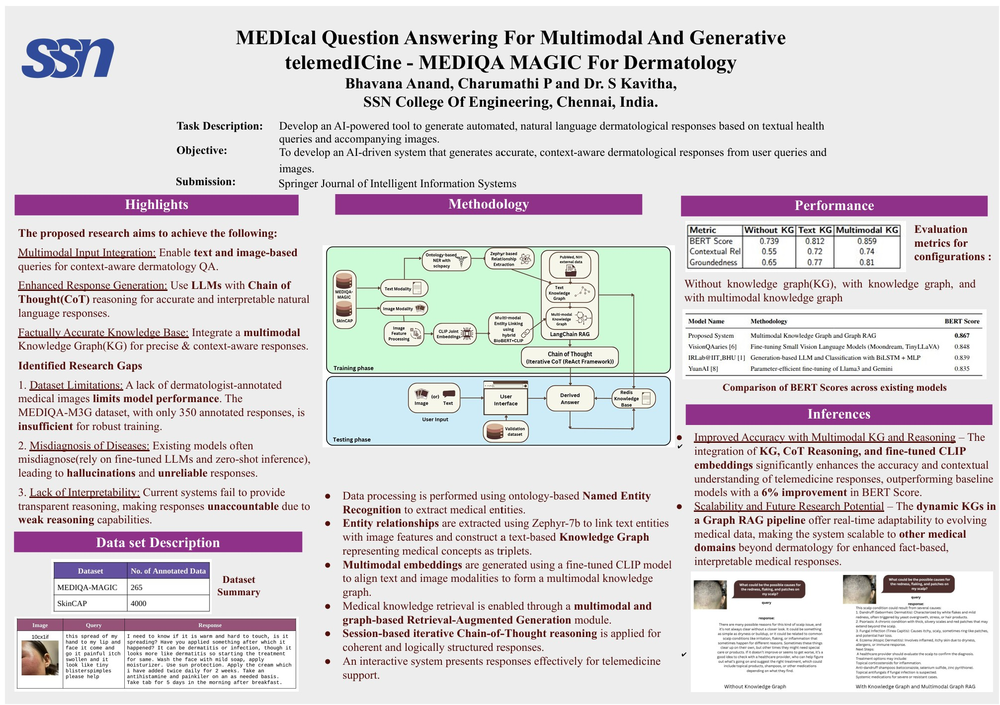

## Project Overview
This project implements a multimodal dermatological knowledge system that integrates Natural Language Processing (NLP), Knowledge Graphs (KG), and Multimodal Machine Learning to generate accurate and explainable dermatological responses. The system utilizes a combination of Named Entity Recognition (NER), ontology-based knowledge extraction, multimodal knowledge graph construction, and Retrieval-Augmented Generation (RAG) to provide well-structured responses to user queries.



## File Descriptions

### 1. `preprocessing.py`
- **Input:** Train and validation datasets
- **Output:** Preprocessed datasets
- **Description:**
  - Performs text preprocessing tasks such as cleaning, tokenization, and formatting.
  - Implements an NLP pipeline using a spaCy model for ontology-based Named Entity Recognition (NER).
  - Prepares structured data for downstream tasks like knowledge extraction and multimodal alignment.

### 2. `kg construction.ipynb`
- **Input:** Preprocessed datasets
- **Output:** Knowledge triplets
- **Description:**
  - Uses the Zephyr 7B model to extract contextual relationships between entities.
  - Structures extracted relationships into knowledge graph triplets.
  - Serves as the foundation for constructing a dermatological knowledge base.

### 3. `hybrid mmea.ipynb`
- **Input:** Knowledge triplets and images
- **Output:** Multimodal knowledge graph
- **Description:**
  - Preprocesses input images and extracts visual features.
  - Uses a hybrid approach combining a fine-tuned CLIP model and BioBERT to align image and text modalities.
  - Links entities across modalities based on similarity in a shared latent space.
  - Constructs a comprehensive multimodal knowledge graph.

### 4. `response generation.ipynb`
- **Input:** User query and image, multimodal knowledge graph
- **Output:** Generated dermatological response
- **Description:**
  - Implements a Graph Retrieval-Augmented Generation (Graph RAG) pipeline using LangChain.
  - Retrieves relevant subgraphs from the multimodal knowledge graph.
  - Generates real-time, context-aware dermatological responses.

### 5. `external rag.ipynb`
- **Input:** User query and image
- **Output:** Generated response with external data source citation
- **Description:**
  - Implements a web scraping RAG pipeline using Ollama and LangChain.
  - Retrieves external data when a knowledge triplet is not found in the existing knowledge graph.
  - Enhances response accuracy by incorporating updated and relevant information.

### 6. `app.py`
- **Input:** User query and image
- **Output:** Interactive chat interface with generated response
- **Description:**
  - Powers an interactive chat interface for exploring the multimodal dermatological knowledge base.
  - Incorporates image input, query understanding, and structured knowledge from AI and LLM research in dermatology.
  - Provides informative and explainable responses to user queries.

### 7. `score evaluation.py`
- **Input:** Generated dermatological response and expert-annotated ground truth
- **Output:** Average BERT Score
- **Description:**
  - Computes the semantic similarity between generated dermatological responses and expert-annotated ground truth.
  - Uses BERT Score as a metric to evaluate response quality.
  - Helps assess the effectiveness of the knowledge system.

## Installation & Dependencies
To run the project, ensure you have the following dependencies installed:
```bash
pip install spacy transformers langchain ollama torch torchvision matplotlib pandas numpy requests
```
Additionally, download the required spaCy model:
```bash
python -m spacy download en_core_web_sm
```

## Usage
1. **Preprocess Data:** Run `preprocessing.py` to clean and format datasets.
2. **Construct Knowledge Graph:** Execute `kg construction.ipynb` to generate knowledge triplets.
3. **Create Multimodal Knowledge Graph:** Run `hybrid mmea.ipynb` to integrate textual and visual data.
4. **Generate Responses:** Use `response generation.ipynb` to retrieve relevant information and generate responses.
5. **Retrieve External Knowledge:** Run `external rag.ipynb` for web-based augmentation.
6. **Deploy Chat Application:** Launch `app.py` for an interactive user interface.
7. **Evaluate Performance:** Execute `score evaluation.py` to assess response accuracy.


